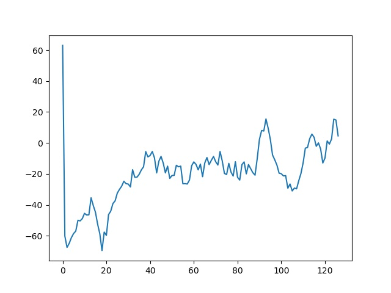

# Weekly Adventures: Doom Reinforcement Learning

Ah yes, I wanted to get back into Machine Learning ~~definitely not just because I want to add another thing to semi flex~~. Using Machine Learning to identify handwritten digits, Image Recognition and more seems boring through. I want something more exciting, more fun, and what better way then to get started than through making my very own Game AI?

## ~~Tensorflow 2 rant~~ Why PyTorch

There are many Machine Learning courses online. I tried following some guides and testing much of the code locally and on Google Colab.

Problem, they don't work half the time.
I see things like this:
```
tf.reset_default_graph()
AttributeError: module 'tensorflow' has no attribute 'reset_default_graph'
```

Because Tensorflow 2 exists, backwards compatability with old libraries is broken and stuff doesn't work as well. Also installing old tensorflow is a pain.  I'm thinking I need to code this from scratch and stuff but Tensorflow is also generally not as easy to read for me. I don't understand half the function names like what is this supposed to mean?
```
gradient_function = K.gradients(cost_function, model_input_layer)[0]
grab_cost_and_gradients_from_model = K.function([model_input_layer], [cost_function, gradient_function])
```

I realised that PyTorch exists. Just a simple google search of `PyTorch Tutorial` gets me [this official guide](https://pytorch.org/tutorials/) on the first entry. This guide is a wonderful entry into using the library. PyTorch offers some benefits like
1. Being more Pythonic and object-oriented apparently. Basically code is easier to read.
    * `torch.nn.Module` gives you the ability to define reusable modules in an OOP and is generally awesome
2. The recipies on the official guide work almost all time time (meanwhile, the ones I find with Tensorflow work like 10% of the time)
3. One of the biggest features that distinguish PyTorch from TensorFlow is declarative data parallelism: you can use torch.nn.DataParallel to wrap any module and it will be (almost magically) parallelized over batch dimension. This way you can leverage multiple GPUs with almost no effort.

## Concept

Reinforcement Learning

Very Brief and Oversimplified Explanation (I may come back and improve this if I feel like it):
1. There is an environment (like a game).
    * You are given it's current state (image, score, whatever)
    * The Agent(Program) can take certain actions
    * For a certain action and state, it will receive a reward (either positive or negative score)
2. The agent wants to maximise the reward. It uses a Deep Neural Network to predict the action which will give the best value. The Agent then takes that action (Value-Based Method)
    * Some other implementations instead predict the action directly
3. Using the rewards it recieves in real time, the Agent trains itself to be better at predicting and interacting in the environment.

Some other concepts
1. Exploration/ Exploitation Trade off
    * What is the probability the agent should exploit: Take the most optimal action **vs**
    * explore: Doing other actions to potentially discover even more optimal actions
2. The reward decreases over time for the same action
    * Encourages the agent to take the most optimal reward from the very start
3. Time
    * In some games, time is an important consideration (eg. is an enemy moving towards you).
    * One way to solve this is by stacking frames (putting a few frames together and passing it into the machine learning model)
4. Memory
    * The agent stores past experiences, and randomly picks some of them for training to avoid making the same mistakes again

Useful resources to learn more
1. https://github.com/simoninithomas/Deep_reinforcement_learning_Course
    * Following V1 of the course should be fine

## What I Did

Combine [this](https://github.com/simoninithomas/Deep_reinforcement_learning_Course/blob/master/Deep%20Q%20Learning/Doom/Deep%20Q%20learning%20with%20Doom.ipynb) and [this](https://pytorch.org/tutorials/intermediate/mario_rl_tutorial.html) to make my own Doom playing AI that works. Since I actually can't find a simple one that works.

What it basically does
1. Stack the frames
2. Runs it through a DDQN network (I'm not qualified to write about this yet)
3. ???
4. Profit

[My Code](https://github.com/Hackin7/Programming-Crappy-Boilerplates/tree/master/Machine%20Learning/PyTorch/Reinforcement%20Learning/Doom%20AI)

## Training



Err... wel... machine learning is a long process.

Some estimates (on my 2017 Core i5 Laptop, AMD Radeon Graphics(Entry Level) )
1. The reward score will fluctuate, but to see improvement, you have to wait for about 30 min to see significant improvement
2. About 45min to see single digit negative reward?
3. About 1h 10min to see positive rewards? 2h to see consistent positive rewards?
4. The memory alone is like 2.3GB? Prepare your RAM for this
5. 2.5h for double digit positive rewards?

[Training Video](training.webm)

## TLDR
1. Tensorflow 2 is something that exists. Try PyTorch for less compatability issues
2. Bla Bla Deep Q Learning stuff
3. I made a DDQN Doom AI that works ok enough I guess
